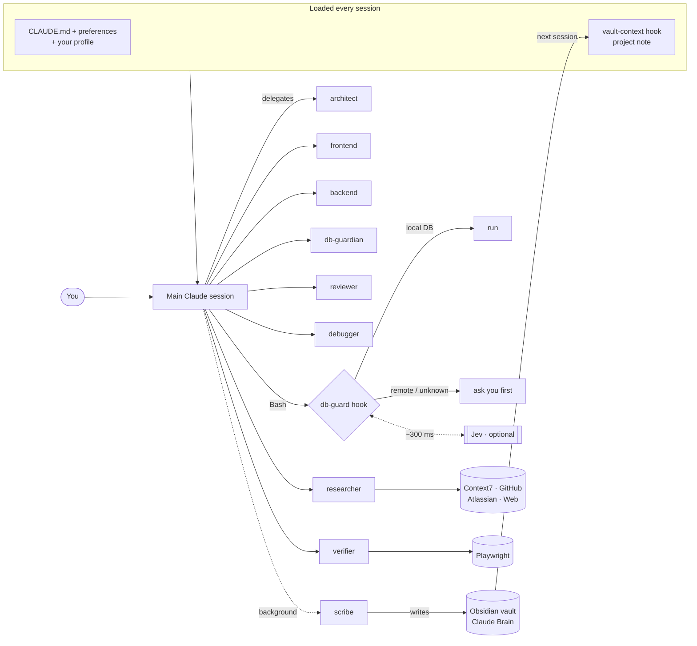
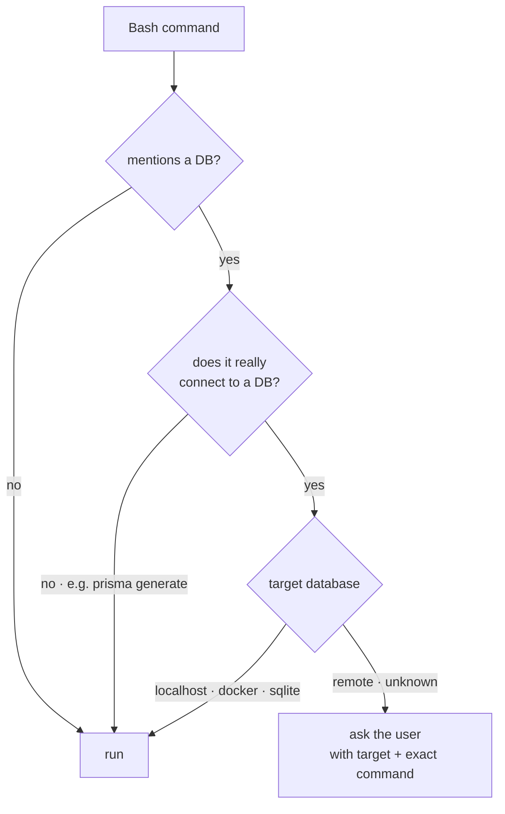

<div align="center">

# 🧠 claude-setup

**A complete, opinionated Claude Code setup: subagents, global rules, safety hooks, long-term memory and MCP servers, installed with one command.**


</div>

---

## Why

Claude Code gets much better once it knows **how you work**: which specialist to call for what, what it must never do to a database, where your project context lives, and how you like your commits. This repo turns all of that into versioned files you can install on any machine in a minute, then fork and make your own.

## What you get

| | |
|---|---|
| 🤖 **9 specialized subagents** | Architect, frontend, backend, DB guardian, reviewer, verifier, debugger, researcher and scribe. Each has the right model, tools and permissions. |
| 📜 **Global rules** | Concise answers, no code comments, commits as you (no co-author trailers), a strict database policy, and "prove it works" before saying done. |
| 🛡️ **Database guard** | A hook that lets Claude use **local** test databases freely but makes it **ask first** for anything remote. An optional fast decision model ([Jev](https://docs.typesafe.ai)) handles the judgement calls. |
| 🗂️ **Long-term memory** | An Obsidian vault ("Claude Brain") with one living note per project, injected automatically when a session starts. |
| 🔌 **MCP servers, skills and plugins** | Context7, Playwright, Atlassian and GitHub MCP servers, Supabase skills and the official TypeSafe plugin. |
| ⚙️ **One `.env`** | Languages, default model, vault path and keys. Edit it, re-run the installer, and only what changed is applied. |

## Architecture



## Quick start

**Requirements:** [Claude Code](https://docs.claude.com/en/docs/claude-code), `git`, `python3` (3.8+), `node`/`npx`. [Obsidian](https://obsidian.md) is optional but recommended.

```bash
git clone https://github.com/<you>/claude-setup.git ~/claude-setup
cd ~/claude-setup

./install.sh               # first run creates .env and ~/.claude/profile.md
$EDITOR .env               # languages, model, keys (all optional)
$EDITOR ~/.claude/profile.md   # tell Claude who you are
./install.sh               # apply
```

Then:
1. Restart Claude Code.
2. Run `/mcp` once and log in to Atlassian (OAuth), if you use Jira/Confluence.
3. In Obsidian: **Open folder as vault**, then pick the vault folder the installer printed.

> [!TIP]
> The installer is **idempotent**. Re-running it applies only what changed, such as a new language, a rotated GitHub token or a new agent. When new options are added to `.env.example`, they are appended to your `.env` automatically.

## Configuration

### `.env` — preferences and keys (git-ignored)

| Variable | Default | What it does |
|---|---|---|
| `RESPONSE_LANGUAGE` | `English` | Language for Claude's replies, subagents and vault notes |
| `UI_LANGUAGE` | `en-US` | Language for UI copy in the apps Claude builds |
| `CODE_LANGUAGE` | `English` | Language for code, commits and identifiers |
| `DEFAULT_MODEL` | *empty* | Main session model (`opus`, `sonnet`, `haiku`, `fable` or a full id). Empty leaves your current setting alone. You can always switch with `/model` |
| `CLAUDE_BRAIN_DIR` | *auto* | Vault folder. Defaults to `C:\Claude Brain` on WSL (so Windows Obsidian can open it) and `~/Claude Brain` elsewhere |
| `VAULT_PROJECTS_DIR` | `Projects` | Projects folder inside the vault, if you rename or translate it |
| `DB_GUARD` | `on` | Turns the database guard hook on or off |
| `TYPESAFE_API_KEY` | — | Optional Jev key ([get one](https://console.typesafe.ai/keys)). Without it, the guard uses regex only |
| `JEV_MODEL` | `jev-latest` | Jev model |
| `GITHUB_PAT` | — | Token for the GitHub MCP server. If it changes, the installer swaps it |

The installer copies `.env` to `~/.config/claude-setup/secrets.env` (`chmod 600`, read by hooks and your shell). It also generates `~/.claude/preferences.md`, which `CLAUDE.md` imports.

### `~/.claude/profile.md` — who you are (never versioned)

Created once from [`claude/profile.example.md`](claude/profile.example.md) and never overwritten. Put your personal context there: name, role, main stacks, OS and shell, where your repos live, personal rules. Any language works. `CLAUDE.md` imports it, so every session and subagent sees it.

## The agents

| Agent | Model | Access | Use it for |
|---|---|---|---|
| `architect` | Opus | read-only · memory | Planning non-trivial features and refactors before any code |
| `frontend` | Sonnet | full | UI in any stack (Next.js, React, Flutter…), from the design system, Figma *(only when asked)* or from scratch |
| `backend` | Sonnet | full | Endpoints, services, integrations (payments, OAuth, webhooks), tests |
| `db-guardian` | Opus | full · memory | Schema, migrations, RLS, slow queries. Never touches a non-local DB without approval |
| `verifier` | Sonnet | no edits · memory | Proves it works: typecheck, lint, tests, real browser via Playwright |
| `reviewer` | Opus | read-only · memory | Bug and security review of the diff before a commit or PR |
| `debugger` | Opus | full · memory | Root cause for bugs nobody understands |
| `researcher` | Sonnet | read-only | Current docs (Context7), web, GitHub, Jira/Confluence |
| `scribe` | Haiku | vault only · background | Keeps the Obsidian vault up to date |

**Typical feature flow:**

```
architect → frontend / backend / db-guardian → verifier → reviewer → scribe
```

Agents marked *memory* learn across sessions (`~/.claude/agent-memory/`). For example, the verifier remembers how to boot and test each project. Subagents always use the model in their own file, whatever model the main session uses.

## The database guard

Some commands look read-only and still wipe data. Prisma's shadow database is the classic example: point it at a real database and it gets reset. So:



- The target comes from URLs or `-h` in the command. Otherwise it comes from `DATABASE_URL`, `DIRECT_URL` and `SHADOW_DATABASE_URL` in the project's `.env` files.
- "Does it really connect?" is answered by Jev when a key is set, and by a strict regex otherwise.
- **Jev tokens ran out** (401/402/403)? You see a warning once per session, Claude mentions it in its reply, and the guard falls back to regex for 15 minutes.
- `CLAUDE.md` states the same policy, so it also covers database MCP servers and scripts the hook can't see.

Jev also ships as a tiny stdlib-only CLI:

```bash
echo "Help! Payouts failing for 3 days" | ~/.claude/hooks/jev.py noul "Is this urgent?"
# {"type": "noul", "noul": 0.93}
```

## Long-term memory: the vault

```
Claude Brain/
├── Home.md        # conventions (the scribe follows this file)
├── Projects/      # one living note per repo: stack, current state, next steps, pitfalls
├── Decisions/     # ADR-style technical decisions
├── Sessions/      # short logs of sessions that changed something
├── Knowledge/     # cross-project learnings (tool gotchas, recipes)
├── Inbox/
└── Templates/     # Project, Decision, Session
```

- **Read:** when a session starts inside a git repo, a hook injects `Projects/<repo-folder>.md`.
- **Write:** after meaningful work, Claude sends a summary to the `scribe` agent in the background.
- **Localize it:** rename the folders, update the table in `Home.md`, and set `VAULT_PROJECTS_DIR`. The scribe writes notes in your `RESPONSE_LANGUAGE`.
- **Split of concerns:** *behavior rules* live in `CLAUDE.md` and Claude's auto-memory; *project context* (state, decisions, history) lives in the vault.

## Make it yours

Everything under `claude/` is **symlinked** into `~/.claude`. Edit the files here, restart Claude Code, and commit.

| To… | Edit |
|---|---|
| Change a global rule | `claude/CLAUDE.md` |
| Tune an agent (model, tools, prompt) | `claude/agents/<name>.md` |
| Add an agent | Create `claude/agents/<name>.md` with `name`, `description`, `model`, and `tools` or `disallowedTools` ([format](https://docs.claude.com/en/docs/claude-code/sub-agents)) |
| Add a hook | Drop the script in `claude/hooks/`, register it in `claude/settings.base.json` |
| Add an MCP server | Add an `add_mcp` line in `install.sh` |
| Add a config option | Add it to `.env.example` and read it in `install.sh` or a hook |
| Change vault templates | `vault/` (only used when a new vault is created) |

## What the installer sets up

| Kind | Items |
|---|---|
| Symlinks | `CLAUDE.md`, `agents/`, `hooks/`, `skills/commit` → this repo |
| Generated files | `~/.claude/preferences.md` (from `.env`), `~/.claude/profile.md` (once, from the template) |
| Settings (merged) | SessionStart and PreToolUse hooks, commit/PR attribution off, `model`, `language` |
| MCP servers (user scope) | `context7`, `playwright`, `atlassian`, `github` |
| Skills | `/commit` (this repo), `supabase`, `supabase-postgres-best-practices`, `find-skills` |
| Plugins | `typesafe@typesafe-ai` (official Jev skill) |
| Vault | A new vault from the skeleton. An existing vault is never touched |

Anything the installer replaces is moved to `~/.claude/backups/claude-setup-<timestamp>/`.

## Repo layout

```
claude-setup/
├── install.sh                # idempotent installer
├── .env.example              # every option, with defaults
├── claude/
│   ├── CLAUDE.md             # global rules (imports preferences + profile)
│   ├── profile.example.md    # template for ~/.claude/profile.md
│   ├── settings.base.json    # merged into ~/.claude/settings.json
│   ├── agents/               # 9 subagents
│   ├── hooks/
│   │   ├── vault-context.sh  # SessionStart: inject the project note
│   │   ├── db-guard.py       # PreToolUse(Bash): database guard
│   │   └── jev.py            # stdlib-only TypeSafe client + CLI
│   └── skills/commit/        # /commit
└── vault/                    # vault skeleton (Home + templates)
```

## Not in this repo (on purpose)

- **`.env` and `~/.claude/profile.md`**: your keys and personal details.
- **Vault content**: project notes can hold client details. Sync your vault separately (Obsidian Sync, a cloud drive or a private git repo).
- **Claude's auto-memory** (`~/.claude/projects/*/memory`) and **agent memory** (`~/.claude/agent-memory/`): these stay on the machine.

## Uninstall / rollback

```bash
rm ~/.claude/CLAUDE.md ~/.claude/agents ~/.claude/hooks ~/.claude/skills/commit ~/.claude/preferences.md
cp -r ~/.claude/backups/claude-setup-<timestamp>/* ~/.claude/   # restore what was there before
# then remove the vault-context and db-guard entries from ~/.claude/settings.json
```

## Troubleshooting

| Symptom | Fix |
|---|---|
| Agents don't show up | Restart Claude Code. Check that `ls -la ~/.claude/agents` points into this repo |
| Too many database permission prompts | Point your project's test `DATABASE_URL` at `localhost`, or set `DB_GUARD=off` |
| No project context at session start | Check that the session runs inside a git repo and that `VAULT_PROJECTS_DIR` matches your vault |
| Atlassian tools missing | Run `/mcp` and log in |
| Changed `.env` but nothing happened | Re-run `./install.sh`, then restart Claude Code |

---

## 🤖 For AI agents: how to install this

If the user asked you to install this repository, follow these steps exactly:

1. Check that `git`, `python3`, `node`/`npx` and `claude` exist (`command -v`). **Never use `sudo`.** If something needs it, ask the user to install it.
2. Run `./install.sh` from the repo root and read the whole output.
3. If `.env` was just created, **ask the user** to fill it in (languages, optional `TYPESAFE_API_KEY` and `GITHUB_PAT`). Never invent values, and never ask the user to paste keys into the chat. Offer to draft `~/.claude/profile.md` from what the user tells you. Then run `./install.sh` again.
4. Verify:
   - `ls -la ~/.claude/agents ~/.claude/hooks` shows symlinks into this repo.
   - `python3 -m json.tool ~/.claude/settings.json` succeeds.
   - `cat ~/.claude/preferences.md` shows the chosen languages.
5. Tell the user to restart Claude Code, run `/mcp` (Atlassian login, if used) and open the vault folder in Obsidian.
6. Do not commit or push unless the user asks.
