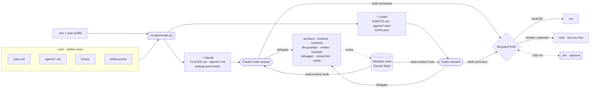

<div align="center">

# 🧠 My AI Agents Architecture

**One opinionated setup for Claude Code and Codex: subagents, global rules, safety hooks, long-term memory and MCP servers, written once and installed into both with one command.**


</div>

---

## Why

Coding agents get much better once they know **how you work**: which specialist to call for what, what they must never do to a database, where your project context lives, and how you like your commits. This repo turns all of that into versioned files. You write each rule, agent and hook **once**, in a tool-neutral format, and the installer renders it into what each tool reads.

## What you get

| | |
|---|---|
| 🔀 **Two tools, one source** | `core/` holds the rules, agents, hooks and skills. `scripts/render.py` turns them into `CLAUDE.md` + Markdown agents for Claude Code and `AGENTS.md` + TOML agents for Codex. |
| 🤖 **9 specialized subagents** | Architect, frontend, backend, DB guardian, reviewer, verifier, debugger, researcher and scribe. Each has the right model tier, effort and permissions in both tools. |
| 📜 **Global rules** | Concise answers, no code comments, commits as you (no co-author trailers), a strict database policy, and "prove it works" before saying done. |
| 🛡️ **Database guard** | A hook that lets the agent use **local** test databases freely but stops it on anything remote until you approve. An optional fast decision model ([Jev](https://docs.typesafe.ai)) handles the judgement calls. |
| 🗂️ **Long-term memory** | An Obsidian vault ("Claude Brain") with one living note per project, injected automatically when a session starts, in either tool. |
| 🔌 **MCP servers, skills and plugins** | Context7, Playwright, Atlassian and GitHub MCP servers, Supabase skills and the official TypeSafe skill, configured for both tools. |
| ⚙️ **One `.env`** | Which tools, languages, models per tier, vault path and keys. Edit it, re-run the installer, and only what changed is applied. |

## Architecture



## Quick start

**Requirements:** `git`, `python3` (3.8+), `node`/`npx`, and at least one of [Claude Code](https://docs.claude.com/en/docs/claude-code) or [Codex](https://developers.openai.com/codex). [Obsidian](https://obsidian.md) is optional but recommended.

```bash
git clone https://github.com/<you>/My-AI-Agents-Architecture.git ~/my-ai-agents
cd ~/my-ai-agents

./install.sh                                  # first run creates .env and your profile
$EDITOR .env                                  # tools, languages, models, keys (all optional)
$EDITOR ~/.config/my-ai-agents/profile.md     # tell the agents who you are
./install.sh                                  # apply
```

Then:
1. Restart Claude Code and/or Codex.
2. **Codex:** run `/hooks` once and trust the two hooks. Codex only runs hooks you have reviewed, and asks again whenever `hooks.json` changes.
3. **Atlassian (OAuth), if you use Jira/Confluence:** `/mcp` in Claude Code, `codex mcp login atlassian` for Codex.
4. In Obsidian: **Open folder as vault**, then pick the vault folder the installer printed.

> [!TIP]
> The installer is **idempotent**. Re-running it applies only what changed, such as a new language, a rotated GitHub token or a new agent. When new options are added to `.env.example`, they are appended to your `.env` automatically. `./install.sh --offline` skips MCP servers, skills and plugins and is enough after editing `core/`.

## Claude Code vs. Codex

Everything in `core/` works in both tools. Where the tools differ, the renderer adapts:

| | Claude Code | Codex |
|---|---|---|
| Global rules | `~/.claude/CLAUDE.md` | `~/.codex/AGENTS.md` |
| Subagents | `~/.claude/agents/*.md` | `~/.codex/agents/*.toml` |
| Model per tier | `opus` / `sonnet` / `haiku` | `gpt-6-astra` / `gpt-6.1-sol` / `gpt-6-luna` |
| Read-only agents | `disallowedTools: Write, Edit, NotebookEdit` | `sandbox_mode = "read-only"` |
| Scribe writes only to the vault | `tools: Read, Write, Edit, Glob, Grep, Bash` | `workspace-write` sandbox + the vault as a writable root |
| Hooks | `settings.json` (merged) | `hooks.json` (trust once with `/hooks`) |
| `/commit` skill | `/commit` | `$commit` (from `~/.agents/skills`) |
| Remote DB command | Hook answers **ask**: you approve in the permission prompt | Codex hooks can't ask yet, so the hook **denies**. The agent asks you in chat and, once you approve, re-runs the command prefixed with `DB_GUARD_APPROVED=1` |
| Agent memory across sessions | Native (`memory: user`) | **Same files**: agents read and update `~/.claude/agent-memory/<agent>/MEMORY.md`. Read-only agents hand updates back and the main agent saves them |
| Background scribe | Yes | No: Codex waits for every subagent, so the scribe runs in the foreground (on the fast tier) |
| MCP config | `claude mcp add --scope user` | `[mcp_servers.*]` in `~/.codex/config.toml` |

Pick the tools in `.env` with `TARGETS="claude codex"`, `"claude"` or `"codex"`.

## Configuration

### `.env` — preferences and keys (git-ignored)

| Variable | Default | What it does |
|---|---|---|
| `TARGETS` | `claude codex` | Which tools to set up |
| `RESPONSE_LANGUAGE` | `English` | Language for replies, subagents and vault notes |
| `UI_LANGUAGE` | `en-US` | Language for UI copy in the apps the agents build |
| `CODE_LANGUAGE` | `English` | Language for code, commits and identifiers |
| `CLAUDE_MODEL` / `CODEX_MODEL` | *empty* | Main session model. Empty leaves your current setting alone |
| `CLAUDE_MODEL_{DEEP,BALANCED,FAST}` | `opus` / `sonnet` / `haiku` | Subagent model per tier. Empty means the subagent inherits the session model |
| `CODEX_MODEL_{DEEP,BALANCED,FAST}` | `gpt-6-astra` / `gpt-6.1-sol` / `gpt-6-luna` | Same, for Codex |
| `CLAUDE_BRAIN_DIR` | *auto* | Vault folder. Defaults to `C:\Claude Brain` on WSL (so Windows Obsidian can open it) and `~/Claude Brain` elsewhere |
| `VAULT_PROJECTS_DIR` | `Projects` | Projects folder inside the vault, if you rename or translate it |
| `DB_GUARD` | `on` | Turns the database guard hook on or off |
| `TYPESAFE_API_KEY` | — | Optional Jev key ([get one](https://console.typesafe.ai/keys)). Without it, the guard uses regex only |
| `JEV_MODEL` | `jev-latest` | Jev model |
| `GITHUB_PAT` | — | Token for the GitHub MCP server. If it changes, the installer swaps it in both tools |

Tiers: **deep** is `architect`, `db-guardian`, `reviewer` and `debugger`; **balanced** is `frontend`, `backend`, `verifier` and `researcher`; **fast** is `scribe`.

The installer copies `.env` to `~/.config/my-ai-agents/secrets.env` (`chmod 600`, read by hooks and your shell).

### `~/.config/my-ai-agents/profile.md` — who you are (never versioned)

Created once from [`core/profile.example.md`](core/profile.example.md) and never overwritten. Put your personal context there: name, role, main stacks, OS and shell, where your repos live, personal rules. Any language works. The renderer inlines it into `CLAUDE.md` and `AGENTS.md`, so every session and subagent in both tools sees it. Re-run `./install.sh --offline` after editing it.

## The agents

| Agent | Tier | Access | Use it for |
|---|---|---|---|
| `architect` | deep | read-only · memory | Planning non-trivial features and refactors before any code |
| `frontend` | balanced | full | UI in any stack (Next.js, React, Flutter…), from the design system, Figma *(only when asked)* or from scratch |
| `backend` | balanced | full | Endpoints, services, integrations (payments, OAuth, webhooks), tests |
| `db-guardian` | deep | full · memory | Schema, migrations, RLS, slow queries. Never touches a non-local DB without approval |
| `verifier` | balanced | no edits · memory | Proves it works: typecheck, lint, tests, real browser via Playwright |
| `reviewer` | deep | read-only · memory | Bug and security review of the diff before a commit or PR |
| `debugger` | deep | full · memory | Root cause for bugs nobody understands |
| `researcher` | balanced | read-only | Current docs (Context7), web, GitHub, Jira/Confluence |
| `scribe` | fast | vault only · background | Keeps the Obsidian vault up to date |

**Typical feature flow:**

```
architect → frontend / backend / db-guardian → verifier → reviewer → scribe
```

Agents marked *memory* learn across sessions in `~/.claude/agent-memory/<agent>/MEMORY.md`, and **both tools share it**: what the verifier learns about booting a project in Claude Code is there the next time Codex runs it, and the other way round. Claude Code loads it natively; for Codex the renderer adds read/update instructions to the agent and the installer adds the folder to the sandbox's writable roots. *Background* only exists in Claude Code. Subagents always use the model of their tier, whatever model the main session uses.

### Agent format

Each agent is one Markdown file in `core/agents/` with neutral frontmatter:

```yaml
---
name: reviewer
description: Reviews the current diff … Read-only.
tier: deep            # deep | balanced | fast → model per tool, from .env
effort: high          # low | medium | high | xhigh | max
access: read-only     # read-only | no-edit | full | vault
memory: true          # shared memory in both tools
background: true      # Claude Code only
color: orange         # Claude Code only
claude_disallowed_tools: mcp__atlassian__createJiraIssue, …   # optional extra deny list
---
The prompt. A "## Memory" section says what to remember; for Codex it is turned into instructions to read and update the shared MEMORY.md.
```

## The database guard

Some commands look read-only and still wipe data. Prisma's shadow database is the classic example: point it at a real database and it gets reset. So:


- The target comes from URLs or `-h` in the command. Otherwise it comes from `DATABASE_URL`, `DIRECT_URL` and `SHADOW_DATABASE_URL` in the project's `.env` files.
- "Does it really connect?" is answered by Jev when a key is set, and by a strict regex otherwise.
- **Claude Code** shows its own permission prompt. **Codex** blocks the command; the agent must ask you, and only after you approve may it re-run the same command prefixed with `DB_GUARD_APPROVED=1`. The rules forbid using the prefix on its own initiative. Codex's sandbox and approval policy add a second layer on top.
- **Jev tokens ran out** (401/402/403)? You see a warning once per session, the agent mentions it in its reply, and the guard falls back to regex for 15 minutes.
- The global rules state the same policy, so it also covers database MCP servers and scripts the hook can't see.

Jev also ships as a tiny stdlib-only CLI:

```bash
echo "Help! Payouts failing for 3 days" | ~/.claude/hooks/jev.py noul "Is this urgent?"
# {"type": "noul", "noul": 0.93}
```

## Long-term memory: the vault

```
Claude Brain/
├── Home.md        # conventions (the scribe follows this file)
├── Projects/      # one living note per repo: stack, current state, next steps, pitfalls
├── Decisions/     # ADR-style technical decisions
├── Sessions/      # short logs of sessions that changed something
├── Knowledge/     # cross-project learnings (tool gotchas, recipes)
├── Inbox/
└── Templates/     # Project, Decision, Session
```

- **Read:** when a session starts inside a git repo, a hook injects `Projects/<repo-folder>.md`. Same hook, both tools.
- **Write:** after meaningful work, the agent sends a summary to the `scribe`.
- **Shared:** Claude Code and Codex read and write the same vault, so context carries over when you switch tools.
- **Localize it:** rename the folders, update the table in `Home.md`, and set `VAULT_PROJECTS_DIR`. The scribe writes notes in your `RESPONSE_LANGUAGE`.
- **Split of concerns:** *behavior rules* live in the global rules and each tool's own memory; *project context* (state, decisions, history) lives in the vault.

## Make it yours

Edit `core/`, run `./install.sh --offline`, restart the tool, and commit. Hooks and the commit skill are symlinked, so changes to them apply immediately.

| To… | Edit |
|---|---|
| Change a global rule | `core/rules.md`. Wrap tool-specific lines in `<!-- if claude -->` … `<!-- endif -->` (or `codex`) |
| Tune an agent (tier, access, prompt) | `core/agents/<name>.md` |
| Add an agent | Create `core/agents/<name>.md` in the [format above](#agent-format) |
| Change models | `CLAUDE_MODEL_*` / `CODEX_MODEL_*` in `.env` |
| Add a hook | Drop the script in `core/hooks/`, register it in `targets/claude/settings.base.json` and in `codex_hooks()` in `scripts/render.py` |
| Add an MCP server | Add an `add_mcp` line (Claude Code) and an `add_codex_mcp` line (Codex) in `install.sh` |
| Add a config option | Add it to `.env.example` and read it in `install.sh`, `scripts/render.py` or a hook |
| Change vault templates | `vault/` (only used when a new vault is created) |

## What the installer sets up

| Kind | Claude Code | Codex |
|---|---|---|
| Rendered (symlinks into `build/`) | `CLAUDE.md`, `agents/` | `AGENTS.md`, `agents/`, `hooks.json` |
| Symlinks into `core/` | `hooks/`, `skills/commit` | `hooks/`, `~/.agents/skills/commit` |
| Settings | `settings.json` merged: hooks, commit/PR attribution off, `model`, `language` | `config.toml`: `model` (if set), MCP servers, and the vault + agent memory as `writable_roots` |
| MCP servers | `context7`, `playwright`, `atlassian`, `github` (user scope) | same, in `config.toml` |
| Skills | `supabase`, `supabase-postgres-best-practices`, `find-skills` | same (shared in `~/.agents/skills`) |
| TypeSafe | `typesafe@typesafe-ai` plugin | `typesafe-ai` skill |

Shared by both: `~/.config/my-ai-agents/` (secrets and profile) and the vault (a new one from the skeleton; an existing vault is never touched).

Anything the installer replaces is moved to `~/.claude/backups/my-ai-agents-<timestamp>/` or `~/.codex/backups/my-ai-agents-<timestamp>/`.

## Repo layout

```
my-ai-agents/
├── install.sh                  # idempotent installer for both tools
├── .env.example                # every option, with defaults
├── core/                       # tool-neutral source of truth
│   ├── rules.md                # global rules (template with per-tool blocks)
│   ├── profile.example.md      # template for ~/.config/my-ai-agents/profile.md
│   ├── agents/                 # 9 subagents, neutral frontmatter
│   ├── hooks/
│   │   ├── vault-context.sh    # SessionStart: inject the project note
│   │   ├── db-guard.py         # PreToolUse(Bash): database guard (--codex for Codex)
│   │   └── jev.py              # stdlib-only TypeSafe client + CLI
│   └── skills/commit/          # /commit ($commit in Codex)
├── targets/claude/
│   └── settings.base.json      # merged into ~/.claude/settings.json
├── scripts/render.py           # core/ → build/claude, build/codex
├── build/                      # rendered files (git-ignored)
└── vault/                      # vault skeleton (Home + templates)
```

## Not in this repo (on purpose)

- **`.env`, your profile and `build/`**: your keys and personal details (the rendered rules include your profile).
- **Vault content**: project notes can hold client details. Sync your vault separately (Obsidian Sync, a cloud drive or a private git repo).
- **Memory** (`~/.claude/projects/*/memory`, the shared `~/.claude/agent-memory/`, Codex memories): these stay on the machine.

## Uninstall / rollback

```bash
# Claude Code
rm ~/.claude/CLAUDE.md ~/.claude/agents ~/.claude/hooks ~/.claude/skills/commit
cp -r ~/.claude/backups/my-ai-agents-<timestamp>/* ~/.claude/   # restore what was there before
# then remove the vault-context and db-guard entries from ~/.claude/settings.json

# Codex
rm ~/.codex/AGENTS.md ~/.codex/agents ~/.codex/hooks ~/.codex/hooks.json ~/.agents/skills/commit
cp -r ~/.codex/backups/my-ai-agents-<timestamp>/* ~/.codex/
# then remove the [mcp_servers.*] sections you don't want from ~/.codex/config.toml
```

## Troubleshooting

| Symptom | Fix |
|---|---|
| Agents don't show up | Restart the tool. Check that `ls -la ~/.claude/agents ~/.codex/agents` points into `build/` |
| Codex hooks don't run | Run `/hooks` in Codex and trust them. Re-trust after `hooks.json` changes |
| Codex keeps blocking a DB command you approved | The re-run must be the exact same command prefixed with `DB_GUARD_APPROVED=1` |
| Too many database permission prompts | Point your project's test `DATABASE_URL` at `localhost`, or set `DB_GUARD=off` |
| No project context at session start | Check that the session runs inside a git repo and that `VAULT_PROJECTS_DIR` matches your vault |
| Atlassian tools missing | `/mcp` in Claude Code, `codex mcp login atlassian` for Codex |
| Changed `.env`, `core/` or your profile but nothing happened | Re-run `./install.sh` (or `--offline`), then restart the tool |
| Moved or renamed this repo folder | Re-run `./install.sh`; it repoints every symlink |

---

## 🤖 For AI agents: how to install this

If the user asked you to install this repository, follow these steps exactly:

1. Check that `git`, `python3`, `node`/`npx` exist, and which of `claude` and `codex` are installed (`command -v`). **Never use `sudo`.** If something needs it, ask the user to install it.
2. Run `./install.sh` from the repo root and read the whole output.
3. If `.env` was just created, **ask the user** to fill it in (`TARGETS`, languages, optional `TYPESAFE_API_KEY` and `GITHUB_PAT`). Never invent values, and never ask the user to paste keys into the chat. Offer to draft `~/.config/my-ai-agents/profile.md` from what the user tells you. Then run `./install.sh` again.
4. Verify:
   - `ls -la ~/.claude/agents ~/.codex/agents` shows symlinks into this repo's `build/`.
   - `python3 -m json.tool ~/.claude/settings.json` succeeds.
   - `head -20 ~/.claude/CLAUDE.md ~/.codex/AGENTS.md` shows the chosen languages and the user's profile.
5. Tell the user to restart the tools, run `/hooks` in Codex to trust the hooks, log in to Atlassian if used (`/mcp` / `codex mcp login atlassian`) and open the vault folder in Obsidian.
6. Do not commit or push unless the user asks.
